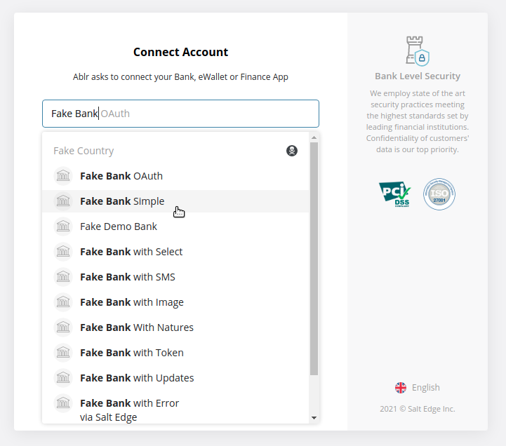

# Test Credentials

## SMS one-time password (OTP)

Use dummy code `123456`. No SMS will actually be sent on Staging.

## (Malaysia) Sign up using eKYC

To bypass identity verification and credit check on Staging, make sure the full legal name contains the word "**Mariam**" (case-insensitive)

To simulate:

- Bankruptcy: use legal name "**Mariam Bankrupted**"
- Bad credit (e.g. some instalments in arrears): use legal name "**Mariam Badcredit**".
- Limit application rejection: use legal name "**Mariam Decline**".

## Credit Card Details

You can use any of the following test cards to simulate a successful payment for different billing countries. Use any 3 digits	for CVV and any future expiry date (and any 5-digit Zipcode for US test cards if applicable)

- Singapore (SG): 4000 0070 2000 0003
- Malaysia (MY): 4000 0045 8000 0002

Testing for specific responses and errors:

Number               | Description |
---------------------|-------------|
4000 0000 0000 0341  | Attaching this card to a Customer succeeds, but attempts to charge the customer fail. |

## Income / Salary Verification

To "Connect to your bank", search for "**Fake Bank**" to use one of "Fake Bank" options. Follow the intructions on screen.

